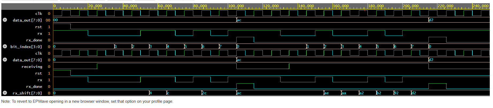

# UART Transmitter and Receiver in Verilog

## Overview
This repository contains the Verilog implementation of a UART (Universal Asynchronous Receiver Transmitter) system.  
The project includes the design of:
- UART Transmitter
- UART Receiver
- Testbench for simulation and verification

## Objective
The goal of this project is to understand UART communication and implement its transmitter and receiver modules using Verilog.

## Tools Used
- Verilog HDL
- GitHub
- Simulation tool: to be updated

## Repository Structure
- `uart_tx.v` → UART transmitter module
- `uart_rx.v` → UART receiver module
- `uart_tb.v` → Testbench
- `README.md` → Project documentation

## Status
Project setup completed. Verilog implementation will be added step by step.
## Simulation Results

### UART Transmitter Verification
The UART transmitter was simulated using a Verilog testbench in EDA Playground.

#### Test cases used
- First input data: `8'hAC`
- Second input data: `8'hD2`

#### Observations
- `tx_start` is asserted to begin transmission.
- `tx_busy` goes high during active transmission and returns low after completion.
- `tx` serially transmits the UART frame bits.
- The transmitter returns to idle state after the frame is sent.

### Waveform Output

## UART Receiver

### Overview
The UART receiver module accepts serial data on the `rx` line and reconstructs the original 8-bit parallel data.  
It detects the start bit, receives the incoming data bits one by one, stores them in an internal shift register, and finally provides the received byte on `data_out`.

### Receiver Inputs and Outputs
**Inputs**
- `clk` : System clock
- `rst` : Reset signal
- `rx` : Serial input line

**Outputs**
- `data_out[7:0]` : Received 8-bit parallel data
- `rx_done` : Indicates that one full byte has been received

### Working of UART Receiver
1. The receiver waits in the idle state while the UART line remains high.
2. When the `rx` line goes low, it is treated as the **start bit** and reception begins.
3. The receiver stores incoming serial bits one by one into an internal register.
4. After receiving 8 bits, the receiver transfers the collected data to `data_out`.
5. `rx_done` goes high for one cycle to indicate successful reception of a full byte.

---

## UART Receiver Simulation Results

### UART Receiver Verification
The UART receiver was simulated using a Verilog testbench in EDA Playground.

#### Test cases used
- First serial frame corresponding to input data: `8'hAC`
- Second serial frame corresponding to input data: `8'hD2`

#### Observations
- The receiver detects the start bit when `rx` goes low.
- Incoming serial bits are stored one by one in the receiver.
- `data_out` updates after all 8 bits are received.
- `rx_done` goes high after successful reception of one byte.
- The receiver returns to idle state after receiving the frame.

### Waveform Output

