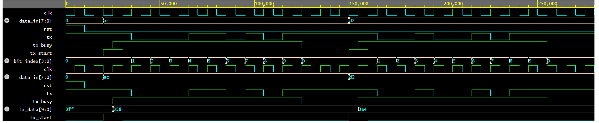

# UART Transmitter and Receiver in Verilog

## Overview
This repository contains the Verilog implementation of a UART (Universal Asynchronous Receiver Transmitter) system.  
The project includes the design of:
- UART Transmitter
- UART Receiver
- Testbench for simulation and verification

## Objective
The goal of this project is to understand UART communication and implement its transmitter and receiver modules using Verilog.

## Tools Used
- Verilog HDL
- GitHub
- Simulation tool: to be updated

## Repository Structure
- `uart_tx.v` → UART transmitter module
- `uart_rx.v` → UART receiver module
- `uart_tb.v` → Testbench
- `README.md` → Project documentation

## Status
Project setup completed. Verilog implementation will be added step by step.
## Simulation Results

### UART Transmitter Verification
The UART transmitter was simulated using a Verilog testbench in EDA Playground.

#### Test cases used
- First input data: `8'hAC`
- Second input data: `8'hD2`

#### Observations
- `tx_start` is asserted to begin transmission.
- `tx_busy` goes high during active transmission and returns low after completion.
- `tx` serially transmits the UART frame bits.
- The transmitter returns to idle state after the frame is sent.

### Waveform Output

